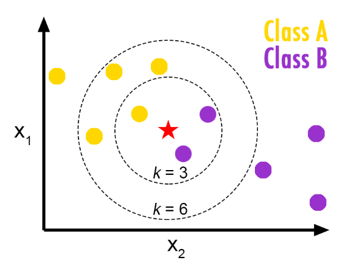

```{r, setup, include=FALSE}
library(knitr)
library(tidyverse)

knit_print.data.frame = function(x, ...) {
    res = paste(c("", "", kable(x, output = FALSE)), collapse = "\n")
    asis_output(res)
}

registerS3method("knit_print", "data.frame", knit_print.data.frame)

options("simputation.hdbackend" = "VIM")

```

# Outline

1. Theory

  - Imputation in general (recap)
  - Donor-based imputation methods
  
1. Practical

  - Apply methods
  - How to in `R`

---
class: inverse, center, middle

# Theory

---

# General theory

- Item or **partiel** non-response

--

- Donor vs model based

- Stochastic or deterministic

- Hot- or cold-deck

--

- Deductive (logical) imputation

---

# Donor imputation

Two general approaches:

1. Nearest neighbor

  - KNN
    - Distance in multidimensional space

  - Predictive mean matching

1. Random draws (stratified)

---

# Donor imputation

When is a donor good enough?

And can different donors be used for the same observations?

--

3 cases:

1. Complete:
  - All imputed variables complete for doner
  - Same donor for all variables

1. Univariate
  - Variables are imputed one by one
  - Seperate donors for each variable

1. Multivariate
  - Donor pool for each missingness value
  - Same donor for all variables

---

# KNN
- Find the K nearest neighbors
  - K = 1: Pure donor imputation
  - K > 1: "Average" of the donors




.footnote[Source: [medium.com](https://medium.com/machine-learning-researcher/k-nearest-neighbors-in-machine-learning-e794014abd2a)]
---

# Predictive mean matching

- Mix between model and donor based imputation

- Method:

  1. Estimate a  model predicting the missing variable(s)
  2. Form predictions for all observation
  3. Donor is the observation with the closest predicted value
  
- From here a KNN with K = 1
- A way to redefine a multidimensional problem into a one dimensional problem

---

# Example: Linear prediction (1/2)

```{r, echo=FALSE, message=FALSE, fig.height=7, fig.align='center'}

ggplot(data = mtcars, aes(x = wt, y = hp)) +
  geom_smooth(method = "lm", se = FALSE, size = 2) +
  geom_point(size = 3) +
  theme_minimal() +
  theme(axis.title = element_blank(), axis.text = element_blank())
```

---

# Example: Linear prediction (2/2)

```{r, echo=FALSE, message=FALSE, fig.height=7, fig.align='center'}
last_plot() +
  geom_vline(mapping = aes(xintercept = 4), size = 2, colour = "red")
```

---

# Random draws

  - Sequential or **random**
  
  - **With** or without replacement or maximum donations per donor

---
class: inverse, center, middle

# Practical

---

# Simulated LFS

```{r, message=FALSE}
library(tidyverse)
lfs <- read_csv("example.csv", col_types = "inffnn") %>% 
  as.data.frame()

head(lfs)
```

---

```{r}
summary(lfs)
```

--

## Partial non-response!

---

```{r}
lfs %>% count(employed, is.na(hours))
```

--

## Routing: employed = 0 => hours not asked (NA is valid)

--

## Logical imputation: hours answered => the person is employed

--

## 51 missing cells left

---

# Simputation

- R package to make imputations easy, covers:
- **Model based** (optionally add [non-]parametric random residual)
  - linear regression
  - robust linear regression
  - ridge/elasticnet/lasso regression
  - CART models (decision trees)
  - Random forest
- **Multivariate** imputation
  - Imputation based on the expectation-maximization algorithm
  - missForest (=iterative random forest imputation)
- **Donor** imputation (including various donor pool specifications)
  - k-nearest neigbour (based on gower's distance)
  - sequential hotdeck (LOCF, NOCB)
  - random hotdeck
  - Predictive mean matching
- **Other**
  - (groupwise) median imputation (optional random residual)
  - Proxy imputation: copy another variable or use a simple transformation to compute imputed values.
  - Apply trained models for imputation purposes.

---

# Imputation strategy

1. Deductive: If answered hours, then the person is employed.

1. Two step donor imputation:

  1. Employment: Predictive mean matching
  
  1. Hours: Random hot-deck donor

---

# Step 1

```{r}
library(simputation)

lfs_imp <- lfs %>% 
  impute_proxy(formula = employed ~ hours > 0)
```

--

```{r}
lfs_imp %>% count(employed, is.na(hours))
```

---

# Step 2

```{r}
lfs_imp <- lfs %>% 
  impute_proxy(formula = employed ~ hours > 0) %>% 
  impute_pmm(formula = employed ~ age + gender + region)
```

--

```{r}
lfs_imp %>% count(employed, is.na(hours))
```

---

# Step 3

```{r}
lfs_imp <- lfs %>% 
  impute_proxy(formula = employed ~ hours > 0) %>% 
  impute_pmm(formula = employed ~ age + gender + region) %>% 
  impute_rhd(formula = hours ~ age + gender + region | employed)
```

--

```{r}
lfs_imp %>% count(employed, is.na(hours))
```

---

```{r}
lfs_imp %>% filter(employed==1, age==21)
```

--

# No donors in the strata for id = 21

--

# "Easy" solution => Random donor in 10 year age group

---

# Step 4

```{r}
lfs_imp <- lfs %>% 
  impute_proxy(formula = employed ~ hours > 0) %>% 
  impute_pmm(formula = employed ~ age + gender + region) %>% 
  impute_rhd(formula = hours ~ age + gender + region | employed) %>% 
  mutate(age10 = age %/% 10) %>% 
  impute_rhd(formula = hours ~ age10 | employed) %>% 
  select(-age10)
```

--

```{r}
lfs_imp %>% count(employed, is.na(hours))
```

---

# New micro data

```{r}
lfs_imp %>% anti_join(lfs, by = names(lfs_imp)) %>% slice_sample(n=10)
```

---

# Alternative ML solution

```{r}
lfs_mf <- lfs %>% 
  mutate(hours = if_else(employed == 0, 0, hours),
         employed = as.factor(as.character(employed))) %>% 
  as.data.frame() %>% 
  impute_mf(formula = . - id ~ . - id) %>% 
  mutate(employed = as.numeric(as.character(employed)),
         hours = if_else(hours == 0, NA_real_, hours))

lfs_mf %>% count(employed, is.na(hours))
```
---
class: inverse, center, middle

# Questions?
## (ressources next slide)

---

# Ressources

Presentation: [GitHub](https://github.com/akselthomsen/Twinning-Geostat-2020)

EU / MEMOBUST: [Handbook on imputation](https://ec.europa.eu/eurostat/cros/content/imputation_en)

CRAN Task View: [Official Statistics & Survey Methodology](https://cran.r-project.org/web/views/OfficialStatistics.html)

Mark van der loo: [simputation: Simple Imputation](https://CRAN.R-project.org/package=simputation)

RStudio: [Tidyverse collection of R packages](https://www.tidyverse.org/)

Awesome official statistics software: [GSBPM & R packages](https://github.com/SNStatComp/awesome-official-statistics-software)


